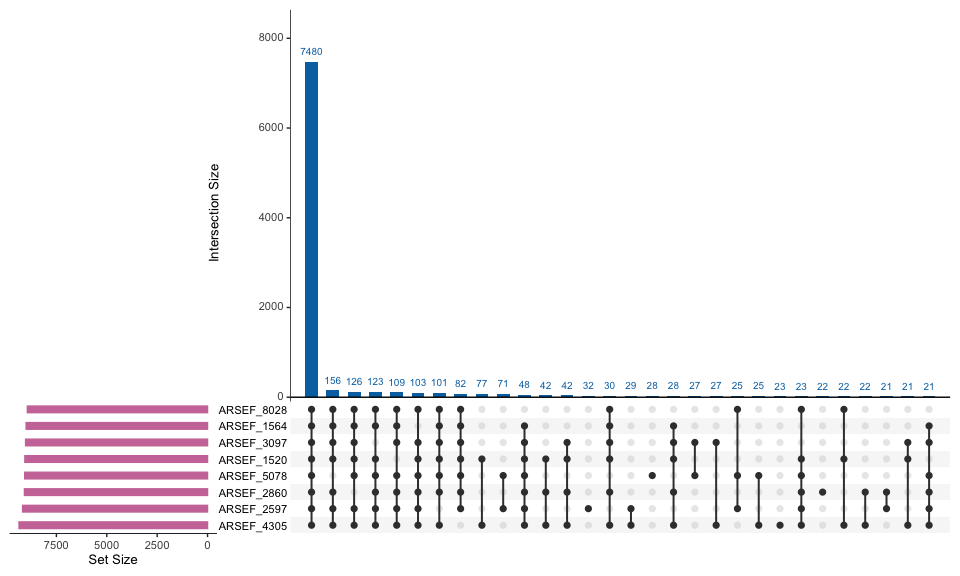
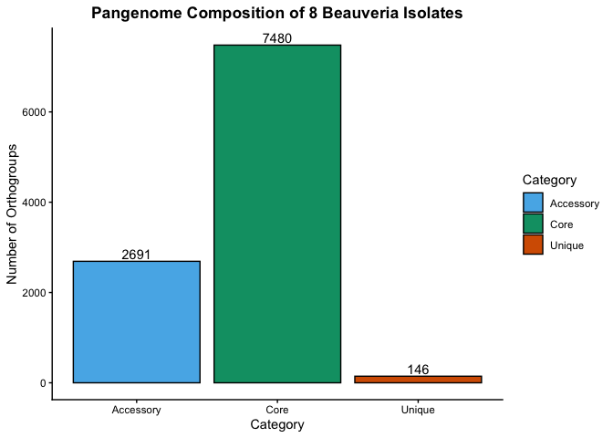
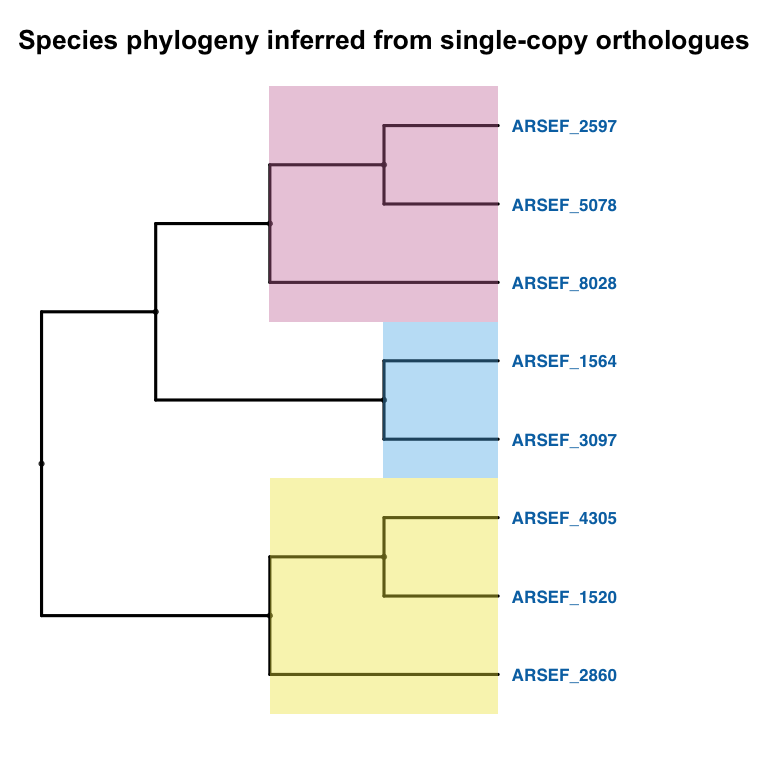

## Install / load packages

``` r
# install.packages("UpSetR")
# install.packages("ggtree")
library(UpSetR)
library(tidyverse)
library(ggtree)
```

    ## Warning: package 'ggtree' was built under R version 4.5.3

``` r
cbbPalette <- c("#000000", "#E69F00", "#56B4E9", "#009E73", "#F0E442",
                 "#0072B2", "#D55E00", "#CC79A7")
```

## Load data

``` r
orthogroups <- read.delim(("Data/Orthogroups.tsv"),
                           header = TRUE,
                           stringsAsFactors = FALSE,
                           check.names = FALSE)
```

## Convert gene content to presence (1) / absence (0)

``` r
binary_matrix <- orthogroups %>%
  mutate(across(-Orthogroup, ~ ifelse(. == "", 0, 1)))

binary_only <- binary_matrix[, -1]
head(binary_only)
```

    ##   ARSEF_1520 ARSEF_1564 ARSEF_2597 ARSEF_2860 ARSEF_3097 ARSEF_4305 ARSEF_5078
    ## 1          1          1          1          1          1          1          1
    ## 2          1          1          1          0          1          1          1
    ## 3          1          1          1          1          1          1          1
    ## 4          1          1          1          1          1          1          1
    ## 5          1          0          1          0          1          1          1
    ## 6          0          0          1          1          1          1          1
    ##   ARSEF_8028
    ## 1          1
    ## 2          1
    ## 3          1
    ## 4          1
    ## 5          1
    ## 6          1

``` r
n_species <- ncol(binary_only)
```

## Control 1: Known answer

Before trusting the presence/absence conversion on real data, run it on
a tiny hand-built case where the correct answer is obvious by eye.

``` r
toy <- data.frame(Orthogroup = c("OG_all", "OG_two", "OG_none"),
                   sp1 = c("geneA", "geneB", ""),
                   sp2 = c("geneA", "geneB", ""),
                   sp3 = c("geneA", "", ""),
                   stringsAsFactors = FALSE)

toy_binary <- toy %>%
  mutate(across(-Orthogroup, ~ ifelse(. == "", 0, 1)))

# Only "OG_all" is shared by all 3 toy columns -> known core count is 1
stopifnot(sum(rowSums(toy_binary[,-1]) == 3) == 1)
```

## Control 2: Invariant

No matter what the real data say, every orthogroup must be present in at
least 1 and at most `n_species` genomes (OrthoFinder never emits an
all-absent row, and a genome can’t appear “more than once” per row).

``` r
presence_sum_check <- rowSums(binary_only)
stopifnot(all(presence_sum_check >= 1 & presence_sum_check <= n_species))
```

## UpSet plot

``` r
upset(binary_only,
      nsets = ncol(binary_only),
      nintersects = 30,
      order.by = "freq",
      main.bar.color = "#0072B2",
      sets.bar.color = "#CC79A7",
      text.scale = 1.2)
```

    ## Warning: `aes_string()` was deprecated in ggplot2 3.0.0.
    ## ℹ Please use tidy evaluation idioms with `aes()`.
    ## ℹ See also `vignette("ggplot2-in-packages")` for more information.
    ## ℹ The deprecated feature was likely used in the UpSetR package.
    ##   Please report the issue at <https://github.com/hms-dbmi/UpSetR/issues>.
    ## This warning is displayed once per session.
    ## Call `lifecycle::last_lifecycle_warnings()` to see where this warning was
    ## generated.

    ## Warning: Using `size` aesthetic for lines was deprecated in ggplot2 3.4.0.
    ## ℹ Please use `linewidth` instead.
    ## ℹ The deprecated feature was likely used in the UpSetR package.
    ##   Please report the issue at <https://github.com/hms-dbmi/UpSetR/issues>.
    ## This warning is displayed once per session.
    ## Call `lifecycle::last_lifecycle_warnings()` to see where this warning was
    ## generated.

    ## Warning: The `size` argument of `element_line()` is deprecated as of ggplot2 3.4.0.
    ## ℹ Please use the `linewidth` argument instead.
    ## ℹ The deprecated feature was likely used in the UpSetR package.
    ##   Please report the issue at <https://github.com/hms-dbmi/UpSetR/issues>.
    ## This warning is displayed once per session.
    ## Call `lifecycle::last_lifecycle_warnings()` to see where this warning was
    ## generated.

<!-- -->

## Classify core / accessory / unique orthogroups

``` r
binary_matrix$presence_sum <- rowSums(binary_matrix[, -1])
max(binary_matrix$presence_sum)
```

    ## [1] 8

``` r
unique_ogs <- binary_matrix[binary_matrix$presence_sum == 1, ]
core_ogs <- binary_matrix[binary_matrix$presence_sum == n_species, ]
accessory_ogs <- binary_matrix[binary_matrix$presence_sum > 1 &
                                  binary_matrix$presence_sum < n_species, ]
```

## Control 3: Order of magnitude

Expectation written down *before* inspecting the actual core count.

``` r
expected_core_range <- c(300, 3000)   # adjust based on prior literature for your species
observed_core <- nrow(core_ogs)
cat("Observed core orthogroups:", observed_core,
    "| expected range:", expected_core_range[1], "-", expected_core_range[2], "\n")
```

    ## Observed core orthogroups: 7480 | expected range: 300 - 3000

## Control 4: Redundancy

Compute the core orthogroup count two independent ways and confirm they
agree.

``` r
core_via_rowsums <- sum(rowSums(binary_only) == n_species)
core_via_apply   <- sum(apply(binary_only, 1, function(r) all(r == 1)))
stopifnot(core_via_rowsums == core_via_apply)
```

## Control 5: Positive control (titration)

Plant synthetic orthogroups shared by exactly *k* genomes, for every k
from `n_species` down to 1, and confirm each one is detected at its
correct sharing level.

``` r
titration <- sapply(n_species:1, function(k) {
  row <- rep(0, n_species)
  row[sample(n_species, k)] <- 1
  sum(row) == k
})
names(titration) <- paste0("k=", n_species:1)
stopifnot(all(titration))
titration
```

    ##  k=8  k=7  k=6  k=5  k=4  k=3  k=2  k=1 
    ## TRUE TRUE TRUE TRUE TRUE TRUE TRUE TRUE

## Control 6: Negative control

Shuffle each genome’s column independently — this destroys which genomes
co-occur in an orthogroup while preserving each genome’s total
orthogroup count. Repeat many times to build a null distribution for the
core count, rather than relying on a single comparison.

``` r
null_core <- replicate(100, {
  shuffled <- as.data.frame(lapply(binary_only, sample))
  sum(rowSums(shuffled) == n_species)
})
cat("Negative control null core count: mean =", mean(null_core),
    "sd =", sd(null_core),
    "| observed =", observed_core, "\n")
```

    ## Negative control null core count: mean = 3746.44 sd = 27.41758 | observed = 7480

## Control 7: Determinism

`set.seed(42)` in the setup chunk fixes every random step above (the
positive-control sampling and the negative-control shuffles), so
knitting this document again reproduces every number exactly. Re-run on
another machine or by a labmate to confirm.

## Pangenome composition summary

``` r
summary_df <- data.frame(
  Category = c("Core", "Accessory", "Unique"),
  Count = c(nrow(core_ogs),
            nrow(accessory_ogs),
            nrow(unique_ogs)))

str(summary_df)
```

    ## 'data.frame':    3 obs. of  2 variables:
    ##  $ Category: chr  "Core" "Accessory" "Unique"
    ##  $ Count   : int  7480 2691 146

``` r
summary_df$Category <- as.factor(summary_df$Category)
```

## Pangenome composition bar plot

``` r
ggplot(summary_df, aes(x = Category, y = Count, fill = Category)) +
  geom_bar(stat = "identity", color = "black") +
  geom_text(aes(label = Count, vjust = -0.3)) +
  scale_fill_manual(values = c(cbbPalette[[3]], cbbPalette[[4]], cbbPalette[[7]])) +
  theme_classic() +
  labs(title = "Pangenome Composition of 8 Beauveria Isolates",
       y = "Number of Orthogroups",
       x = "Category") +
  theme(plot.title = element_text(hjust = 0.5, face = "bold"))
```

<!-- -->

## Species phylogeny (ggtree)

``` r
tree <- read.tree("Data/SpeciesTree_rooted.txt")

ggtree(tree, branch.length = "none", size = 1.1) +
  geom_tree() +
  theme_tree() +
  geom_nodepoint(alpha = 0.7) +
  geom_tiplab(color = "#0072B2", size = 4.5, fontface = "bold", offset = 0.1) +
  xlim(0, 6) +
  geom_hilight(node = 10, fill = "#F0E442", alpha = 0.4) +
  geom_hilight(node = 15, fill = "#56B4E9", alpha = 0.4) +
  geom_hilight(node = 13, fill = "#CC79A7", alpha = 0.4) +
  labs(title = "Species phylogeny inferred from single-copy orthologues") +
  theme(
    plot.title = element_text(
      hjust = 0.5,
      vjust = -3,
      face = "bold",
      size = 20
    ))
```

<!-- -->

## Export unique orthogroups

``` r
write_csv(unique_ogs, file = "unique_ogs.csv")
```
